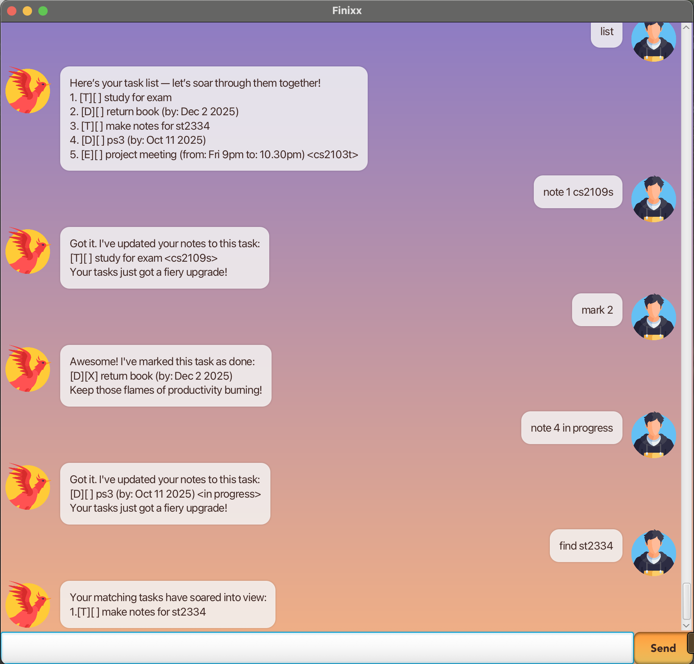

# Finixx User Guide

  
*Phoenix-themed chatbot GUI*

## Product Overview

Finixx is a _phoenix-themed_ desktop chatbot that makes task management magical.  
With its **JavaFX GUI**, you can add **todos**, **deadlines**, and **events**, mark tasks as done, find tasks, add notes, and delete tasks — all in a smooth, chat-like interface.  
Finixx saves your tasks automatically, handles invalid inputs gracefully, and guides you with helpful messages, so you can focus on your work without getting lost.  
**Just launch the app and start typing!** 🔥

---
## Quick Start
1. In your terminal, navigate to the jar location.
2. launch the application using the `java -jar "JAR_FILE_NAME"`.
3. The chat window opens with a greeting and helpful tips.
4. Start typing your commands in the chat box.
5. Finixx will respond interactively, guiding you if the input is incorrect.
6. View your tasks and responses in the scrollable chat window.
7. When done, simply close the window — Finixx will save your tasks automatically.

---
## Adding todos

You can add a simple task without a specific deadline or event time using the `todo` command.  
The description cannot be empty. Optionally, you can add a note separated by `|`.

Command: `todo <description> | <optional note>`

Example: `todo read book | chapter 1`

```
Got it! I've added this task:
[T][ ] read book <chapter 1>
Now you have 1 task in the list.
Keep soaring -- your tasks won't complete themselves!
```

## Adding deadlines

You can add a task with a specific due date using the `deadline` command.  
The description cannot be empty, and the date must be in `yyyy-MM-dd` format.
Optionally, you can add a note separated by `|`.

Command: `deadline <description> /by <yyyy-MM-dd> | <optional note>`

Example: `deadline return book /by 2025-12-31`

```
Got it! I've added this task:
[D][ ] return book (by: Dec 31 2025)
Now you have 2 tasks in the list.
Keep soaring -- your tasks won't complete themselves!
```

## Adding events

You can add a task with a start and end time using the `event` command.  
You must provide a start time and an end time, and optionally a note.

Command: `event <description> /from <start time> /to <end time> | <optional note>`

Example: `event project meeting /from 2pm /to 4pm | discuss milestones`

```
Got it! I've added this task:
[E][ ] project meeting (from: 2pm to: 4pm) <discuss milestones>
Now you have 3 tasks in the list.
Keep soaring -- your tasks won't complete themselves!
```

## Listing tasks

You can list all your tasks using the `list` command.

Command: `list`

```
Here are the tasks in your list:
1. [T][ ] read book <chapter 1>
2. [D][ ] return book (by: Dec 31 2025)
3. [E][ ] project meeting (from: 2pm to: 4pm) <discuss milestones>
``` 

## Help command

You can view a summary of all commands using the `help` command.

Command: `help`

```
Here are the commands you can use:
1. todo <description> | <optional note> - Adds a todo task
2. deadline <description> /by <yyyy-MM-dd> | <optional note> - Adds a deadline task
3. event <description> /from <start time> /to <end time> | <optional note> - Adds an event task
4. list - Lists all tasks
5. help - Shows this help message
6. mark <task number> - Marks a task as done
7. unmark <task number> - Marks a task as not done
8. delete <task number> - Deletes a task
9. find <keyword> - Finds tasks containing the keyword
10. note <task number> <note> - Adds a note to a task
11. bye - Exits the application

Everything is all set, start typing!
```

## Marking tasks as done

You can mark a task as done using the `mark` command followed by the task number.

Command: `mark <task number>`

Example: `mark 1`

```
Awesome! I've marked this task as done:
[T][X] read book <chapter 1>
Keep those flames of productivity burning!
```

## Unmarking tasks as not done

You can unmark a task as not done using the `unmark` command followed by the task number.

Command: `unmark <task number>`

Example: `unmark 1`

```
Ah, I've marked this task as not done yet:
[T][ ] read book <chapter 1>
It's alive.. for now. Let's reignite that spark and get it done!
```

## Deleting tasks

You can delete a task from the list using the `delete` command followed by the task number.

Command: `delete <task number>`

Example: `delete 3`

```
Poof! this task is now removed:
[E][ ] project meeting (from: 2pm to: 4pm) <discuss milestones>
Another obstacle out of your way -- your productivity wings just got stronger!
Now you have 2 tasks in the list.
```

## Finding tasks

You can find tasks containing a specific keyword using the `find` command.

Command: `find <keyword>`

Example: `find read`

```
Your matching tasks have soared into view:
1. [T][ ] read book <chapter 1>
```

## Adding notes to tasks

You can add or update a note to an existing task using the `note` command followed by the task number and the note content.

Command: `note <task number> <note content>`

Example: `note 2 return by end of year`

```
Got it! I've updated your notes to this task:
[D][ ] return book (by: Dec 31 2025) <return by end of year>
Your tasks just got a fiery upgrade!
```

## Exiting the Program

Type `bye` to receive a farewell message from Finixx.

Command: `bye`

```
Goodbye! May your productivity rise from the ashes!🔥
```
> Note: The application window remains open. Close the window manually when you’re done.
---

## FAQ

**Q:** Can I type multiple spaces or malformed commands?  
**A:** Yes, Finixx trims and validates input, and will return friendly error messages if something is wrong.

**Q:** Does `bye` close the app automatically?  
**A:** No, it only displays a farewell message. You need to close the window manually.

**Q:** Can I use this in a CLI?  
**A:** No, Finixx is GUI-only. Use the launcher to start the application.

---
## Interactive Guidance

Finixx guides you even if commands are incomplete or typed incorrectly:

- `todo   ` → `"Ah! You need to give your task a proper description so it can rise from the ashes!"`
- `deadline return book` → `"Whoops! your deadline spell didn't work — use deadline <description> /by <yyyy-MM-dd>"`
- `event project meeting /from /to 4pm` → `"Oops! Your event needs a start time to take flight"`

This means you can learn how to use Finixx **just by chatting with it**.

---

## Saving & Loading

- All tasks are automatically saved to a local file.
- Closing the application preserves your tasks.
- On restart, Finixx loads your tasks automatically.

---

## Exiting the Application

- Simply close the window to exit.
- Finixx will save all your tasks before exiting.
- Typing `bye` displays a goodbye message but does **not** close the app automatically.

---

## Command Summary

| Command                                          | Description                     |
|--------------------------------------------------|---------------------------------|
| `todo <desc> \| <note>`                          | Add a todo task                 |
| `deadline <desc> /by <YYYY-MM-DD> \| <note>`     | Add a deadline task             |
| `event <desc> /from <start> /to <end> \| <note>` | Add an event                    |
| `mark <task number>`                             | Mark a task as done             |
| `unmark <task number>`                           | Mark a task as not done         |
| `delete <task number>`                           | Delete a task                   |
| `note <task number> <text>`                      | Add or update a note for a task |
| `find <keyword>`                                 | Search tasks by keyword         |

---

*Phoenix-themed, magical guidance at every step!*
